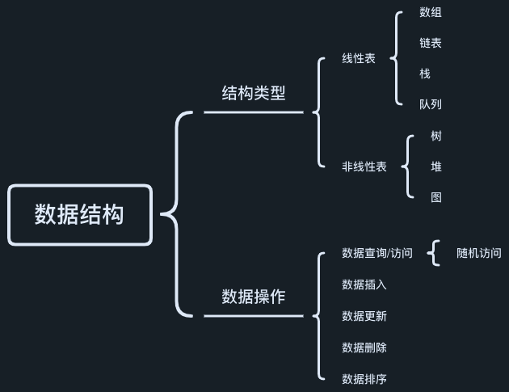

# 数据结构概览

---

## 结构类型

---

### 线性表

#### 数组

结构特点
1. 连续的内存空间
2. 存储相同类型的数据

寻址公式: `array[i] = base_address + i * data_type_size`
> - base_address: 数组内存块的首地址;
> - i: 数组元素的索引位置;
> - data_type_size: 数组元素的大小(内存长度);

#### 链表

#### 栈

#### 队列

### 非线性表

#### 树

#### 堆

#### 图

## 性能评估

---

### 复杂度分析(大O复杂度表示法)

#### 渐进时间复杂度

#### 渐进空间复杂度

#### 常见复杂度级别

- O(1)
- O(logn)
- O(n)
- O(nlogn)
- O(n**2)
- O(2**n)

## 数据操作

---

### 数据查询

- 随机访问

### 数据插入

### 数据更新

### 数据删除

### 数据排序

